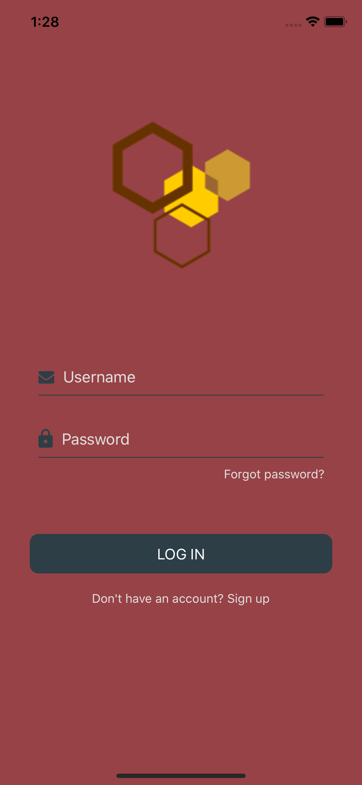
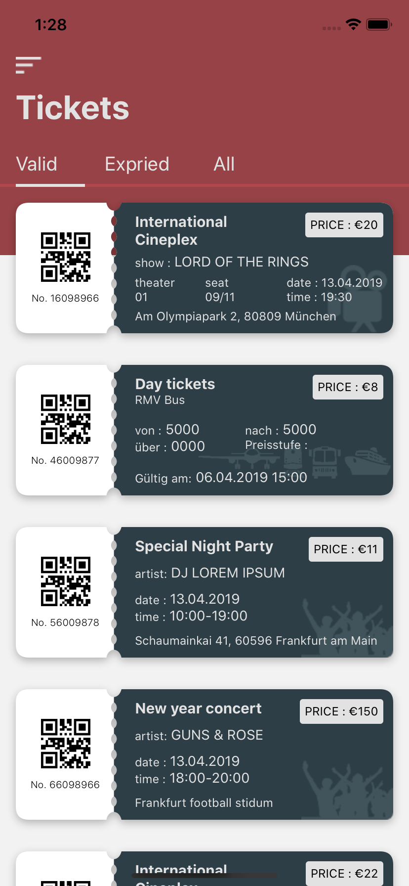
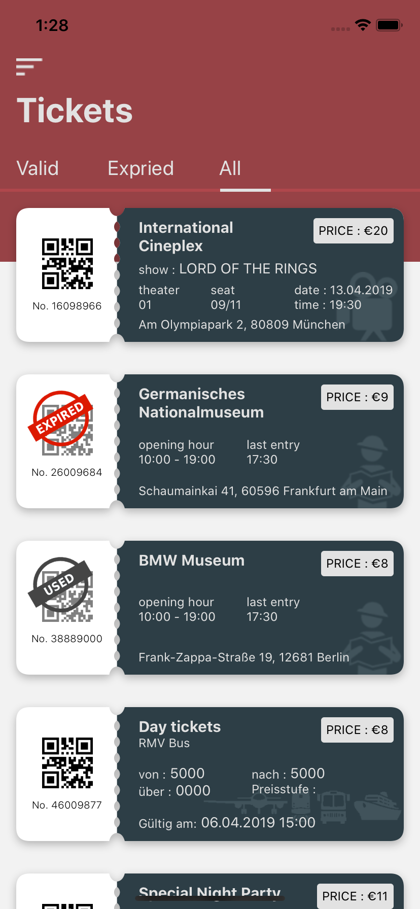
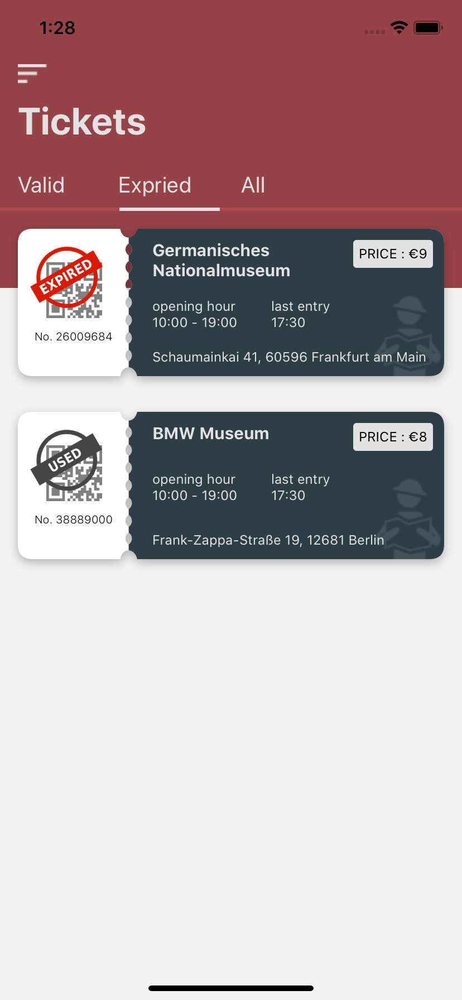
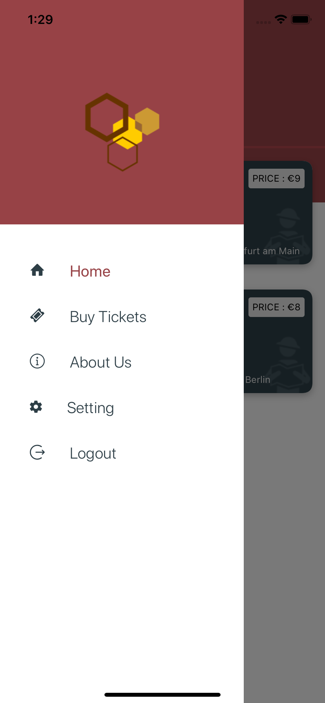
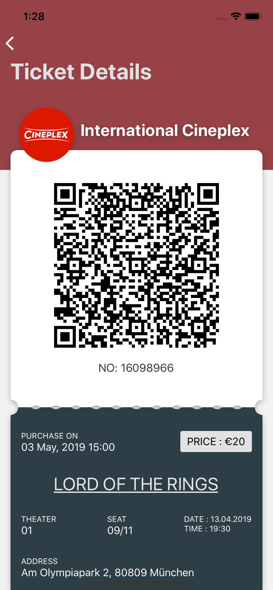
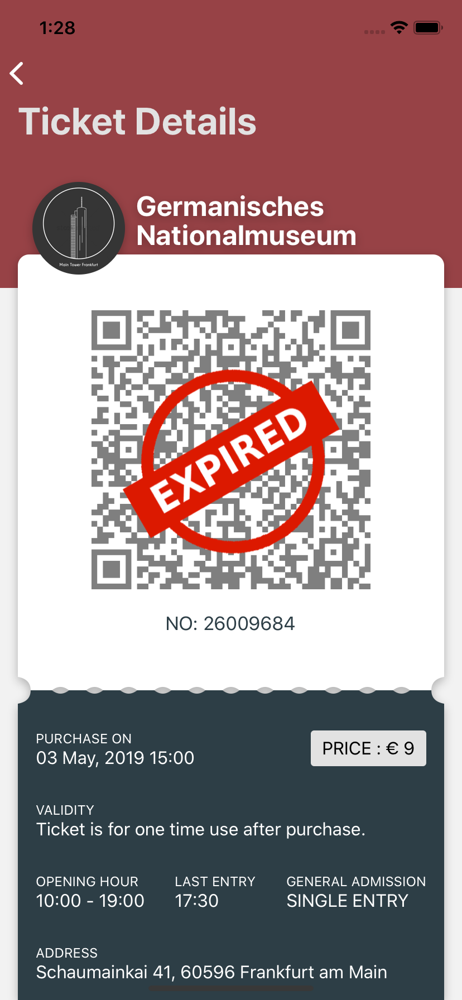
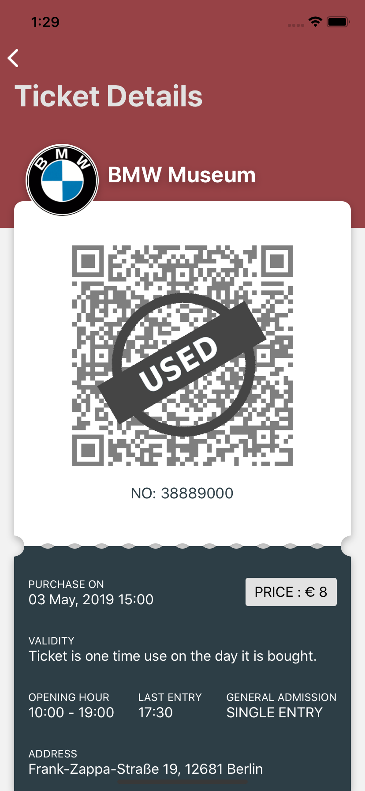
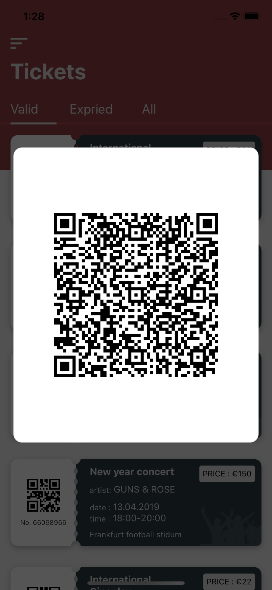

**Online e-ticket system**

It is a simple application that has a list of tickets. It is just a dummy application for demonstrating react native. Expo is used to develop the application. It covers implementation of:

Stack Navigation

Drawer Navigation

svg

QR code

Simple animation

Image

Redux

Icon

Here you can see implementation of:
Conditional rendering of components
Passing properties to child components

**Navigation of the application is like bellow:**

- Stack.Navigator (initalScreen = Login)
  - Login(Screen)
  - DrawerNavigator (initalScreen = TicketStack)
    - TicketStack(Stack.Navigator, initalScreen=TicketList)
      - TicketList (Screen)
      - TicketDetail (Screen)
    - BuyTicket (DrawerItem)
    - AboutUs (DrawerItem)
    - Setting (DrawerItem)
    - Logout (DrawerItem)

When the application initializes it renders the first stack navigator whose initial screen is **Login** so, the login screen will be rendered first. When the login button is clicked then it navigates to **DrawerNavigator.** DrawerNavigator has an initial screen TicketStack which is basically not a screen but another stack navigator. So, from that stack navigator the initial screen will be rendered when the login button is clicked which is **TicketList**.

**Packages used**

- React-navigation packages for navigation
- React-native-svg for svg
- React-natve-qrcode-svg for QR code
- React-redux for redux
- React-native-gesture-handler for ScrollView
- React-native-elements for some UI components

**UI Design**
<table>
  <tr>
    <td></td>
    <td></td>
    <td></td>
  </tr>
   <tr>
    <td></td>
    <td></td>
    <td></td>
  </tr>
   <tr>
    <td></td>
    <td></td>
    <td></td>
  </tr>
 </table>
